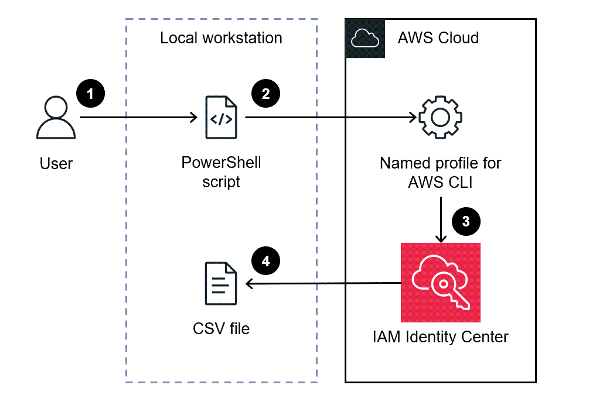

# onp.base.template

## Metadata
| attribute               | value                                         |
| ----------------------- | --------------------------------------------- |
| pattern-id              | onp.base.template                             |
| pattern-name            | base template                                 |
| pattern-version         | 1.0.0                                         |
| pattern-description     | The AWS IAM Identity Center, which is the successor to AWS Single Sign-On, provides a centralized way to manage single sign-on access for AWS accounts and cloud applications. However, manually reporting and auditing the assignments within the AWS Management Console can be a time-consuming task, especially when dealing with multiple AWS accounts and numerous permissions. To simplify this process, many users prefer exporting the information into a spreadsheet application like Microsoft Excel. By leveraging the AWS Tools for PowerShell, you can generate a comprehensive report in CSV format that includes details such as the identity name, identity type (user or group), accounts accessible by the identity, and permission sets. This report can be easily opened in your preferred application, enabling efficient searching, filtering, and auditing of the data across your entire organization managed by AWS Organizations.|                       
| organisation-id         | nc                                            |
| pattern-categories      | bootstrap                                     |

## What is this pattern?
This pattern is a basic template, modify it as you see fit

## What are the use cases?
This pattern is a basic template, modify it as you see fit

## Variables

| Variable               | Source                                         | Value |
| -----------------------| --------------------------------------------- | ------|
| Var1                   | SSM Parameter | onp/bootstrap/base-template|
